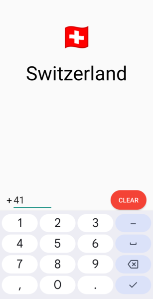

# Country Code App

A simple Android app that identifies countries based on their phone country codes.

## Usage
1. Enter a country code (e.g. 1 for United States)
2. The app will show the matching country name and flag emoji

## Screenshot

